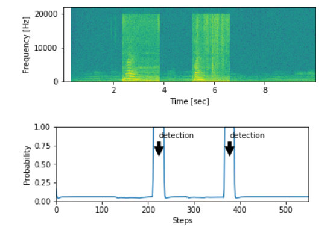

# CatVoiceActivator

CatVoiceActivator is a recurrent/LSTM model that can recongnize cats' meowing sound. This project has three parts. A training set generator
synthisizes training samples, a keras training model that trains the recurrent/LSTM model, and a code for testing the trained model.

Disclaimer: This work is inspired by Andrew Ng's voice triggering GRU project.

## Training set generator

This code uses my own cat's recorded meowing sound, some negative sounds and some other background sounds to generate a training set.
Each background sound is 10 seconds and meow and negative sounds are 1 second. The `generate_sample` function creates training samples by
randomly selecting a random number of meow and negative sounds and inserting them at random times to a randomly selected background sound. PyDub library is used for this. The sound track is then transformed to fft using spectogram of PyPlot (I tried the spectogram of SciPy, but
the result was not as good as matplotlib!).

Training samples require considerable hard drive storage. So, instead of having a unified training set, the training set is divided into several smaller chuncks, each containing 100 samples.

## Training 

A recurrent/LSTM model is built and trained using keras. 1500 samples are used for training the model. The model is made of one convolutional layer, followed by four LSTM/BatchNormalization/Dropout layers. 

## Test

The trained model is evaluated here using some test set. The result is shown below:

